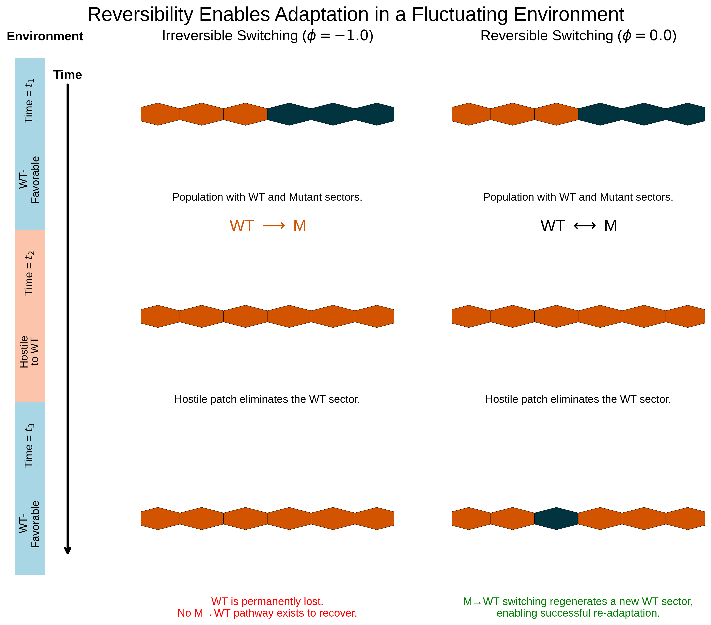

# Fitness at the Expanding Front: An Exploration-Exploitation Trade-off in Phenotypic Switching

**Authors:** Vedant Sharma and Hao Wang

[](https://opensource.org/licenses/MIT)
[](https://doi.org/10.1101/2025.10.27.684987) 

This repository contains the full source code for the large-scale agent-based model (ABM) and analysis scripts used in our manuscript. This work investigates how phenotypic switching strategies determine fitness at the expanding front of a population in a heterogeneous environment.

---

### Abstract

The exploration-exploitation trade-off is a central challenge for organisms in fluctuating environments. Phenotypic switching is a key bet-hedging mechanism used to navigate this trade-off, yet its dynamics in spatially structured populations remain poorly understood. Here, we use a continuous-time, event-driven model to investigate how phenotypic switching strategies determine fitness at the expanding front of a population in a heterogeneous environment. We find that while an optimal, intermediate switching rate maximizes the speed of expansion, the reversibility of the switch is a master regulator of the system's evolutionary trajectory. Irreversible "specialist" strategies are fragile, whereas reversible switching confers a dramatic fitness advantage by allowing the population to regenerate resilient generalist phenotypes. This strategic choice governs the location of the phase transition between specialist persistence and extinction. We also incorporate the intrinsic biological cost of adaptation—a phenotypic switching lag—and show it imposes a hard constraint on fitness, forcing the optimal strategy to shift toward slower, more conservative switching rates. Finally, we show that spatial structure creates emergent phenomena, such as collective protection, where clustering of specialist cells significantly enhances survival, and we show that an experimental paradox of apparent stagnancy of deleterious patches can be explained as observational bias. This work bridges the classic exploration-exploitation trade-off with the biophysical costs of adaptation and the physics of range expansions, providing a robust framework for understanding fitness in complex biological systems.

---

### Key Findings


> *Schematic comparing irreversible vs. reversible switching in a fluctuating environment. (Left) An irreversible strategy (`$\phi = -1.0$`) suffers permanent loss of the WT phenotype in a hostile patch. (Right) A reversible strategy (`$\phi = 0.0$`) allows the WT phenotype to be regenerated from the mutant population, enabling re-adaptation.*

1.  **Optimal Switching Rate:** An optimal, intermediate switching rate maximizes the population's expansion speed by balancing exploration of new environmental patches and exploitation of favorable ones.
2.  **Advantage of Reversibility:** Reversible switching confers a significant fitness advantage over irreversible strategies, particularly under strong selection, by allowing the population to regenerate generalist phenotypes and avoid getting trapped in a maladapted state.
3.  **Cost of Adaptation (Lag):** Incorporating a phenotypic switching lag (a period of non-reproduction during the switch) imposes a hard constraint on fitness and shifts the optimal strategy toward slower, more conservative switching rates.
4.  **Collective Protection:** Spatial clustering of disadvantaged specialist cells provides a survival advantage (collective protection) by minimizing the boundary exposed to selection, especially under strong negative selection.
5.  **Apparent Stagnancy Explained:** The observed stagnancy or slow shrinkage of deleterious mutant patches in experiments can be explained by observational bias conditioned on lineage survival.

---

### Installation

This project is written in Python 3. The core simulation is a continuous-time, event-driven model based on a Gillespie algorithm, implemented on a hexagonal lattice. Analysis scripts use the standard scientific Python stack.

```bash
# 1. Clone the repository
# git clone [YOUR_REPO_URL_HERE] 
# cd [YOUR_REPO_NAME]

# 2. Create and activate a virtual environment (recommended)
python3 -m venv venv
source venv/bin/activate  # On Windows use `venv\Scripts\activate`

# 3. Install required packages
pip install -r requirements.txt 
````

The main dependencies are listed in `requirements.txt` and include:

  * `numpy`
  * `pandas`
  * `scipy`
  * `matplotlib`
  * `seaborn`
  * `tqdm`
  * `typer`
  * `numba` (for accelerating the event tree updates)

-----

### How to Reproduce Our Results

You can manage simulation campaigns and generate figures using the `manage.py` script, which provides a command-line interface. Use `python3 manage.py --help` for details on commands.

**Note:** Running the full simulation sweeps is computationally intensive and requires an HPC environment with Slurm (or modification of the submission scripts). Pre-computed, aggregated data may be provided in the `data/` directory (check `.gitignore` to see if `data/` is tracked).

#### 1\. Generate Simulation Tasks

The `manage.py launch` command first checks the experiment definitions in `src/config.py` against the master task list (`data/<campaign_id>/<campaign_id>_master_tasks.jsonl`) and adds any missing tasks defined by the parameter grids.

```bash
# Example: Generate tasks for the main bet-hedging experiment
python3 manage.py launch bet_hedging_final
```

#### 2\. Submit Simulation Jobs (HPC/Slurm)

The `manage.py launch` command will then identify which tasks have not yet been completed (by checking against the aggregated summary CSV) and generate a temporary `_missing_tasks.jsonl` file. It will prompt you to submit these tasks via `sbatch` using the `scripts/run_chunk.sh` wrapper, which in turn calls the `src/worker.py` script for each simulation instance.

```bash
# Example: Launch missing jobs for the bet-hedging experiment
# (Answer 'yes' when prompted to submit)
python3 manage.py launch bet_hedging_final 
```

  * Raw simulation output (summary `.jsonl` files) will be saved to `data/<campaign_id>/raw/`.
  * Bulkier data (like population snapshots or trajectories) are saved to separate directories (e.g., `data/<campaign_id>/trajectories/`).
  * Slurm logs are saved to `slurm_logs/`.

#### 3\. Consolidate Raw Data

After jobs complete, consolidate the raw `.jsonl` output into a single aggregated CSV file for analysis and plotting. This also moves trajectory/population data to their final locations.

```bash
# Example: Consolidate data for the main bet-hedging campaign
python3 manage.py consolidate fig3_bet_hedging_final 
```

  * Aggregated data is saved to `data/<campaign_id>/analysis/<campaign_id>_summary_aggregated.csv`.
  * Raw files in `data/<campaign_id>/raw/` are deleted after successful consolidation.

#### 4\. Generate Paper Figures

The plotting scripts reside in `scripts/paper_figures/`. You can generate specific figures using the `manage.py plot` command (which needs to be implemented in `manage.py` based on your plotting scripts) or run the scripts directly.

```bash
# Example: Generate Figure 3 (Reversibility)
python3 scripts/paper_figures/fig_reversibility.py

# Example: Generate Figure 5 (Clustering)
python3 scripts/paper_figures/fig_clustering.py

# Example: Generate Figure 6 (Conditioned Mean / Stagnancy)
python3 scripts/paper_figures/fig_linear_radial_comparison.py 

# (Add commands or direct script calls for other figures as needed)
```

  * Figures will be saved to the `figures/` directory.

-----

### Repository Structure

```
reflux/
├── data/                   # Simulation output (potentially gitignored)
│   ├── <campaign_id>/
│   │   ├── analysis/       # Aggregated summary CSVs
│   │   ├── populations/    # Final population state snapshots (.json.gz)
│   │   ├── trajectories/   # Trajectory data (.json.gz)
│   │   ├── timeseries/     # Timeseries data (.json.gz)
│   │   ├── raw/            # Temporary raw output from workers (.jsonl)
│   │   └── *_master_tasks.jsonl # Complete list of tasks for the campaign
│   └── ...
├── figures/                # Final figures for the paper (.pdf, .png, .eps)
├── presentation_figures/   # Figures specifically for presentations
├── scripts/                # Python scripts
│   ├── paper_figures/      # Scripts to generate figures for the manuscript
│   ├── presentation_figures/ # Scripts to generate presentation assets
│   ├── utils/              # Helper scripts (task generation, analysis workers)
│   ├── run_chunk.sh        # Slurm job script to run a batch of simulations
│   └── ...                 # Other utility/visualization scripts
├── src/                    # Core simulation and analysis code
│   ├── core/               # ABM logic, Gillespie, hex grid, models, metrics
│   ├── io/                 # Data loading utilities
│   ├── utils/              # Analysis helper functions
│   ├── config.py           # Defines simulation parameters & experiments
│   └── worker.py           # Script executed by HPC jobs to run a single sim
├── diagram_assets/         # Source files for diagrams (e.g., .svg)
├── slurm_logs/             # Slurm output logs (gitignored)
├── venv/                   # Virtual environment files (gitignored)
├── .gitignore              # Specifies intentionally untracked files
├── LICENSE                 # License file (e.g., MIT)
├── manage.py               # Main CLI for managing campaigns
├── Makefile                # Convenience wrapper for manage.py commands
├── requirements.txt        # Python dependencies
└── readme.md               # This file
```

-----

### Citation

If you use this code or our findings in your research, please cite our preprint:

```bibtex
@article{Sharma2025FitnessFront,
  title   = {Fitness at the Expanding Front: An Exploration-Exploitation Trade-off in Phenotypic Switching},
  author  = {Sharma, Vedant and Wang, Hao},
  journal = {bioRxiv},
  year    = {2025},
  month   = {Oct},
  day     = {28},
  note    = {Preprint},
  url     = {[https://www.biorxiv.org/](https://www.biorxiv.org/)} # <-- TODO: Add actual bioRxiv URL/DOI when available
}
```

*(Please update the URL/DOI once the preprint is available)*

### License

This project is licensed under the MIT License.
